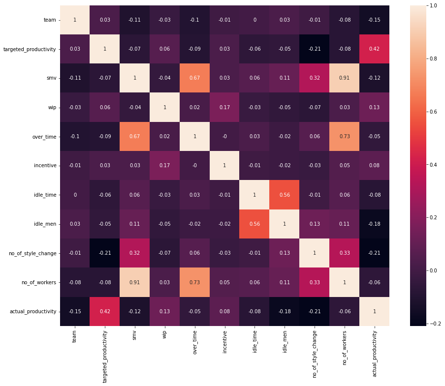
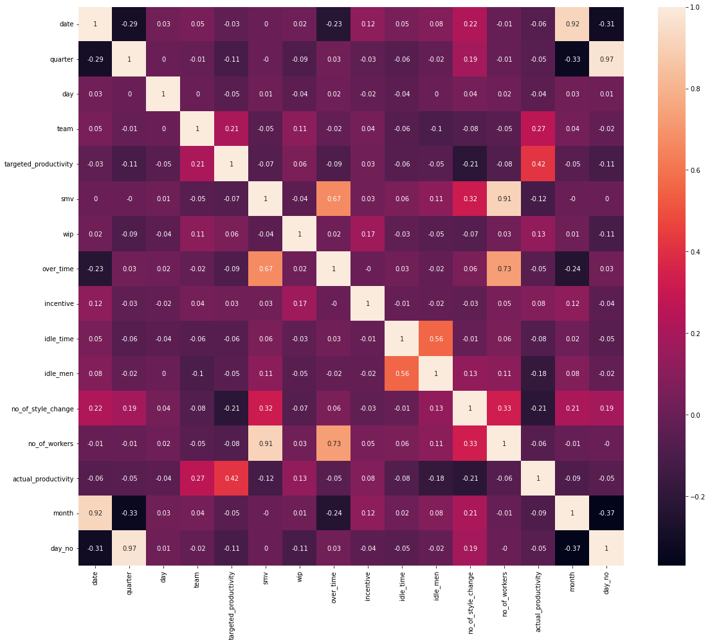
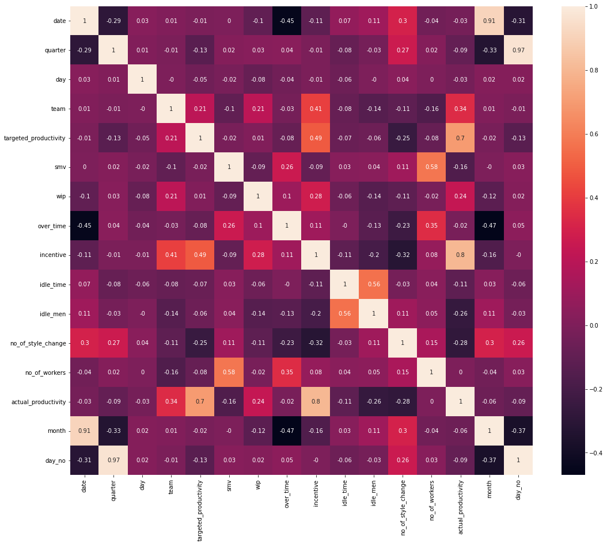
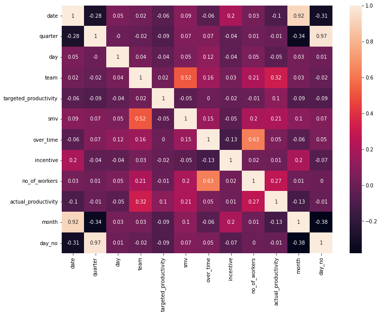
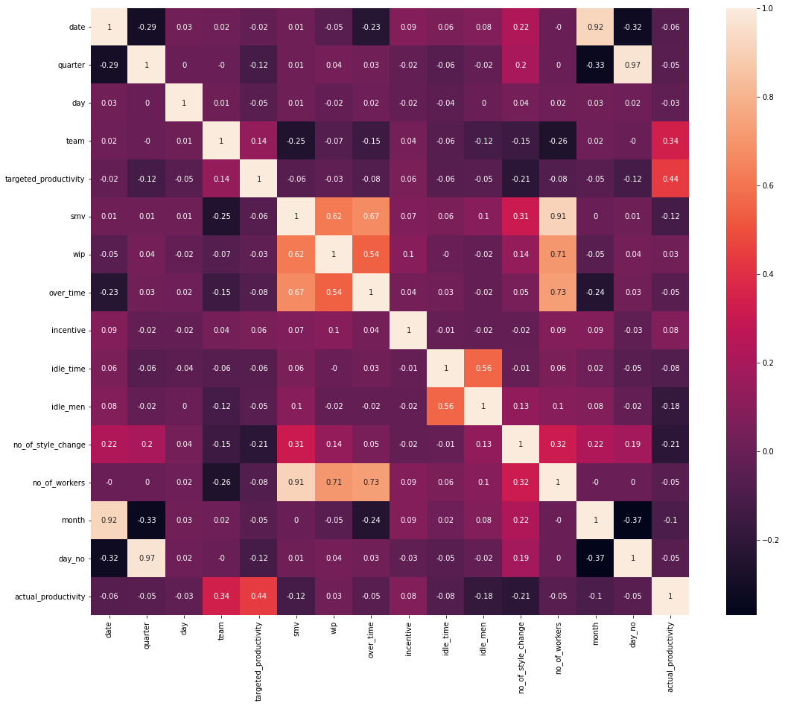
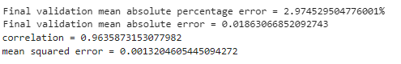
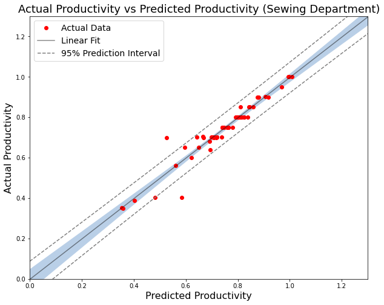
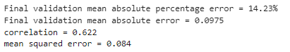
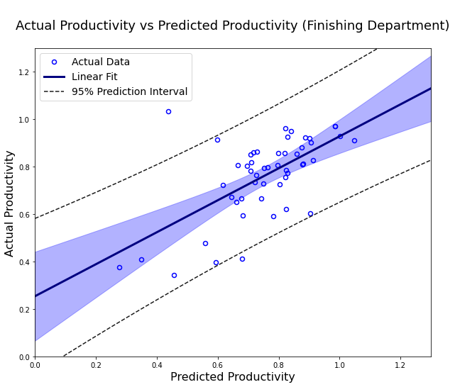

# Productivity Prediction of Garment Employees Data Set 
## 1. Motivation

click to show

The garment industry is vital to human civilization and has a massive global demand. 

A modern garment production companies must track, analyse, and predict the productivity of their working teams in order to estimate their garment production capacity and ensure that production is completed on time. This is crucial in maintaining the company's reputation and avoid paying breach of contract penalties. 

Furthermore, a good prediction model is an essential tool in the development planning of a garment company because it provides the information to streamline the production lines and optimize the production efficiency. 

## 2. Objective

click to show

  
(i) Construct a good prediction model that can be used to predict the employee productivity in European garment Industry. 

(ii) Data mining to determine which attributes in the European garment industry are highly correlated with employee productivity. 

(iii) As a demonstration to show how to construct a dense neural network. 

(iv) As a demonstration to show how to do data cleaning, data preparation, data analysis and data exploration. 
  

  
## 3. The Garment Employee Dataset
### 3.1. Download link

click to show

You can get the dataset download link from <a href="http://archive.ics.uci.edu/ml/datasets/Productivity+Prediction+of+Garment+Employees">here</a>.

  
### 3.2. Summary of the Dataset

click to show
 
  
The data was collected from European countries in the year of 2015. 
  
There are 15 attributes in this dataset. We will make use of the first 14 attributes as the raw features and use them to launch a multilinear regression training by using a dense neural network. Our goal is to train a model that can predict the actual productivity, which is the last attribute of the dataset, with a targeted mean absolute error percentage of less than 10%. 

The 15 attributes in the dataset are summarized as below. 

01 date : Date in MM-DD-YYYY  
02 day : Day of the Week  
03 quarter : A portion of the month. A month was divided into four quarters  
04 department : Associated department with the instance  
05 team_no : Associated team number with the instance  
06 no_of_workers : Number of workers in each team  
07 no_of_style_change : Number of changes in the style of a particular product  
08 targeted_productivity : Targeted productivity set by the Authority for each team for each day  
09 smv : Standard Minute Value, it is the allocated time for a task  
10 wip : Work in progress. Includes the number of unfinished items for products  
11 over_time : Represents the amount of overtime by each team in minutes  
12 incentive : Represents the amount of financial incentive (in BDT) that enables or motivates a particular course of action  
13 idle_time : The amount of time when the production was interrupted due to several reasons  
14 idle_men : The number of workers who were idle due to production interruption  
15 actual_productivity : The actual % of productivity that was delivered by the workers. It ranges from 0-1.  

## 4. IDE, Framework, and Code

click to show
 
 is used as the IDE(integrated development environment) for this project. 
The main frameworks utilised in this project were TensorFlow Keras, Pandas, Numpy, Scikit-Learn, Seaborn, and Matplotlib.  

My code:  

A.  [Sewing Department Productivity Model](Sewing_Model.ipynb)  

B.  [Finishing Department Productivity Model](Finishing_Model.ipynb)  

## 5. Methodology
### 5.1. Data Pipeline

click to show
 
Two models, namely the "Sewing Department Productivity Model" (a.k.a. Sewing-Model) and the "Finishing Department Productivity Model" (a.k.a. Finishing-Model), were constructed separately by using the same model pipeline.   
The differences between the models all stem from their data pipeline, as summarized as follows: 

<table class="center" div align="center">
  <tr>
    <th colspan="3">Data Pipeline</th>
  </tr>                                                          
  <tr>
    <th>Data\Model</th><th>Sewing-Model</th><th>Finishing-Model</th>
  </tr>
  <tr>
    <th>input data</th><td align="center">Sewing department data</td>
    <td align="center">Finishing department training data + all sewing department data</td>
  </tr>
  <tr>
    <th>typo of column name</th><td align="center">Replace ["Sweing", "Finishing "] by ["Sewing","Finishing"] </td><td align="center">Same</td>
  </tr>
  <tr>
    <th>typo of data value</th><td align="center">Replace "targeted_productivity" of index 663 from 0.07 to 0.7</td><td align="center">Same</td>
  </tr>
  <tr>
    <th>average_smv</th><td align="center">(new_features)divided the smv by no of workers</td><td align="center">Same</td>
  </tr>
  <tr>
    <th>wip(work in progress)</th><td align="center">Use the log function to reduce the skewness of the data</td><td align="center">The "wip" data is divided into four groups in order to keep the actual value of the finishing department within the margin of error. (It can be non-zero while still belonging to the lowest value group.)</td>
  </tr>
  <tr>
    <th>date</th><td align="center">Indexed by using chronological order</td><td align="center">Same</td>
  </tr>
  <tr>
    <th>day(weekday)</th><td align="center">Begin with the first consecutive working day in a week(Saturday)</td><td align="center">Same</td>
  </tr>
  <tr>
    <th>quarter(index of week in a month)</th><td align="center">Changed to integers</td><td align="center">Same</td>
  </tr>
  <tr>
    <th>month(/th)<td align="center">(new_features)Extracted from the date</td><td align="center">Same</td>
  </tr>
  <tr>
    <th>day(in months)</th><td align="center">(new_features)Extracted from the date</td><td align="center">Same</td>
  </tr>
  <tr>
    <th>team</th><td align="center">Replaced by the average productivity of the corresponding sewing team</td>
    <td align="center">Replaced by the average productivity of the corresponding departmental team</td>
  </tr>
  <tr>
    <th>train_test_split</th><td align="center">Test_size = 0.2</td>
    <td align="center">Test_size = 0.1 (a small test size is used due to the lacking of data)</td>
  </tr>
</table> 

### 5.2. Models' pipeline 

click to show
 

Both models mentioned above are dense neural network models that are constructed by using the functional API approach. 
Below is the summary of the models: 

## 6. Result
### 6.1. Correlation between Features and Labels (Sewing-Model)

click to show
 
  
#### 6.1.1. In the Raw Data
Please focus on the "actual productivity" column. 

#### 6.1.2. In the Post-Processing Data
We see that the correlation between "team" and "actual productivity" has increased significantly. 
Now we have more features which has non-zero correlation with "actual productivity" to train the model, including "date", "quarter", "day"(weekday), "month", and "day_no" (day in a month).    

#### 6.1.3. After Data Segmentation
After data segmentation, the correlation between "incentive" and "actual productivity" become 10 times larger! 
Also, the correlation between "actual productivity" with the features such as "wip", "team","no of style change","idle time", and "day_no" is further improved. 
Despite there exists some minor decrease of the correlation between "actual productivity" with the features such as "no of worker", "month", and "day", the overall correlation betwwen the features and the "actual productivity" is greatly enhanced after the data segmentation. 

### 6.2. Correlation between Features and Labels (Finishing-Model)

click to show
 

### 6.2.1 In the Finishing Department Data after Data Pre-Processing and Data Segmentation 
The correlations in the raw data are in 6.1.1. 
Here we can see that after we process the data, we have more features to train the model, and the correlation between "team" and "actual productivity" has increased significantly. 
However, since all "wip" data from the finishing department are single-valued, the correlation between it with the multi-valued actual productivity is zero. 

  
### 6.2.2 In All Training Data in the Finishing Model
We can see that all features has non-zero correlation with the label, this means they are contributive to enhance the accuracy of the model. 

  
### 6.3. Sewing Department Productivity Model (a.k.a Sewing-Model)

click to show
 
Performance of the model:
  

The shaded region is surrounded by a 95% confidence interval, within which we are 95% certain that the **mean value** of prediction lies. 
This shall not be confused with the dotted line, which is the 95% prediction interval, within which 95% of our prediction data is contained.

### 6.4. Finishing Department Productivity Model (a.k.a Finishing-Model)

click to show
 
Performance of the model:  

## 7. Analysis and Discussion

click to show
 
"All models are wrong, but some are useful."~<a href="https://en.wikipedia.org/wiki/All_models_are_wrong">George Box</a>   

The Sewing-Model is reasonably well trained, as evidenced by its 96% correlation between its prediction and the actual data. The high correlation can be visually reflected in the plot(see section 6.3), as the 95%-confidence-interval passing through the origin, and the majority of the prediction data converged to a straight line. It also has a validation mean absolute percentage error of 0.019 and a mean absolute percentage error of about 3%.   

The Finishing-Model is significantly inferior to the Sewing-Model, as evidenced by its 62% correlation between its prediction and actual data. The plot (see section 6.4) clearly demonstrates this, as the 95%-confidence-interval does not pass through the origin and the majority of the prediction data appears less convergent. Besides, it has a validation mean absolute percentage error of 0.098 and a mean absolute percentage error of approximately 14%. 

Whatsoever, the linear fit in the Finishing-Model indicates that the prediction data increases linearly with the real data. Furthermore, the 0.62 correlation between the prediction data and the real data suggests that the model isn't all that bad. Therefore, it stands to reason that the Finishing-Model can be improved if more data is provided.    

Data exploration reveals that the main difference between the Finishing-Model and the Sewing-Model in terms of data structure is that the Finishing-Model lacks all "wip" data. The result of poor fitting in the finising model indicates that "wip" is indeed a crucial variable that is highly correlated to employee productivity in the European garment industry. 

The other variables can also be checked in a similar manner. The targeted variable is first removed from the training features. The model is then retrained, and its prediction accuracy is compared to that of the previous model. 

Some may argue that the difference in results between the Sewing-Model and the Finishing-Model is due to differences in team attributes (the mean productivity), but I tested this theory by using the same mean in both models. The prediction accuracy of the Sewing-Model differs only slightly, and the model I presented in the data pipeline is actually marginally more accurate. This leads us to believe that the missing wip data is the primary cause of the inaccuracy of the Finishing-Model when compared to the Sewing-Model. 

On the other hand, if there is an optimal value for the wip data, We can check this by generating some lists of sewing data with all attributes fixed but the wip value different. Then we make use of our fairly well fitted sewing data to predict the productivities of each entry in the list. Then we can gather the optimal value from all the lists to find its mean. This mean will be the overall optimal(ideal) value of the wip data. 

Why is it advantageous to obtain the optimal value of "wip" (work-in-progress) then? The work-in-progress could be distributed to other teams by the manager, ensuring that most teams have the right amount of work to do and can therefore maximize their production. 

However, a general optimal "wip" value is less likely to exist, because its optimal value is the collective result of all other data. We can, in turn, build a model that uses the "wip" as the label and "actual productivity"(wishful productivity) as one of the features. Then we are able to obtain the optimal "wip" value for a specific employee group.   

## 8. Conclusion

click to show
 
  
We have successfully created a good model(the Sewing-Model) with high validation accuracy(validation mean absolute percentage error = 3%, MAE = 0.019) to predict the sewing team productivity in the future. Can this model be used to predict the productivity of all sewing teams in the European garment industry? We can put this question to the test by using data from other sewing teams. One thing is certain: the more sewing team data we collect, the more accurate the model we build. 

The Finishing-Model, on the other hand, may be unsatisfactory with a validation mean absolute percentage error of 14%, but as we can see from the graph, it is not completely useless because we are 95% certain that the real data will fall within a certain interval. For example, if the prediction of productivity is 1.0, we are 95% sure that the actual data falls between 0.65 and 1.21, so it can be a good estimate. More data, in particular the "wip" data, is required to build a better model. 

## 9. Future Work

click to show
 

Are the two models the best we can create with the data we currently have?  
Definitely not!  
For instance, one might think of defining a new feature that tracks the work intensity (let's say, smv*average overtime) of a certain team over the last few days.  
This will undoubtedly aid in the creation of a better model.  
So this project comes to an end here.  
Thank you for your time and I hope you find the reading enjoyable. :-)  

